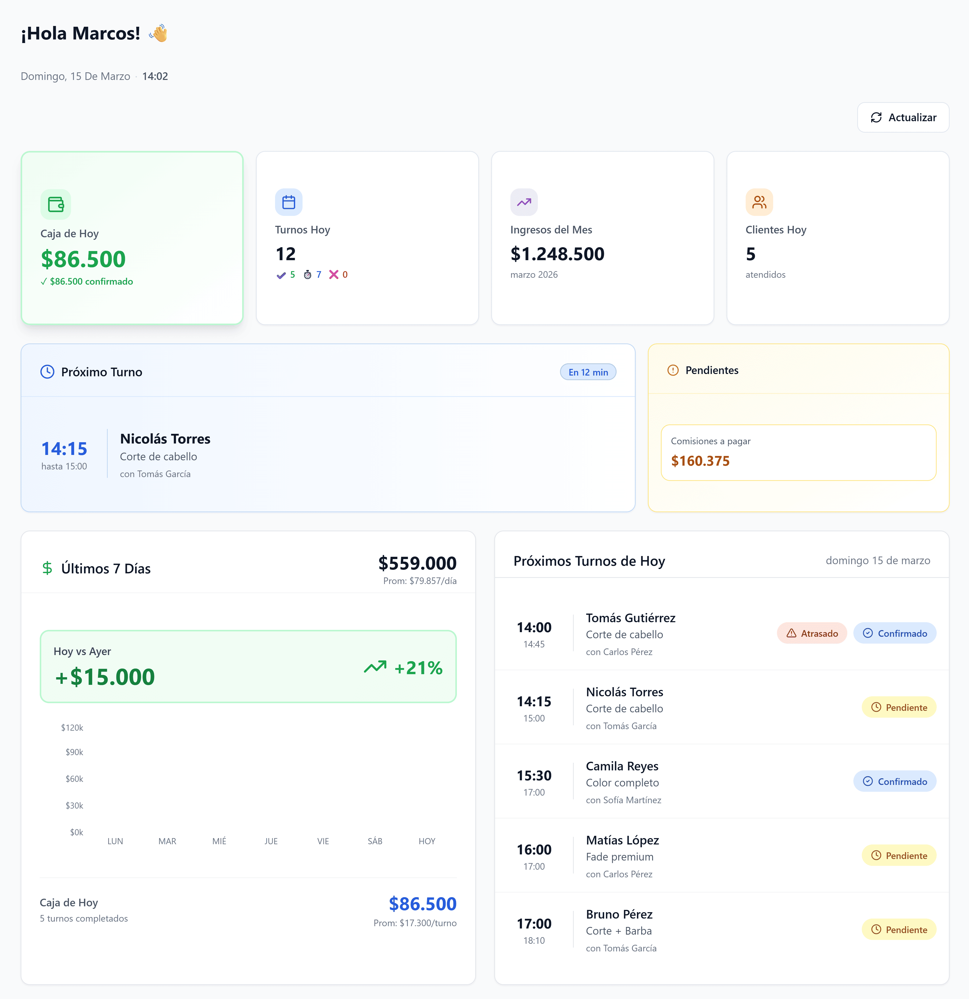
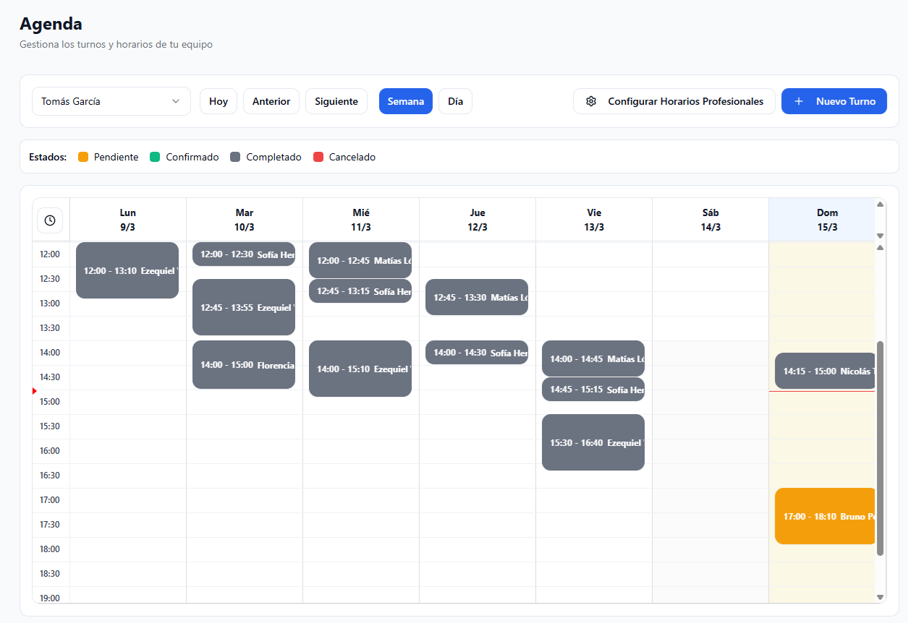
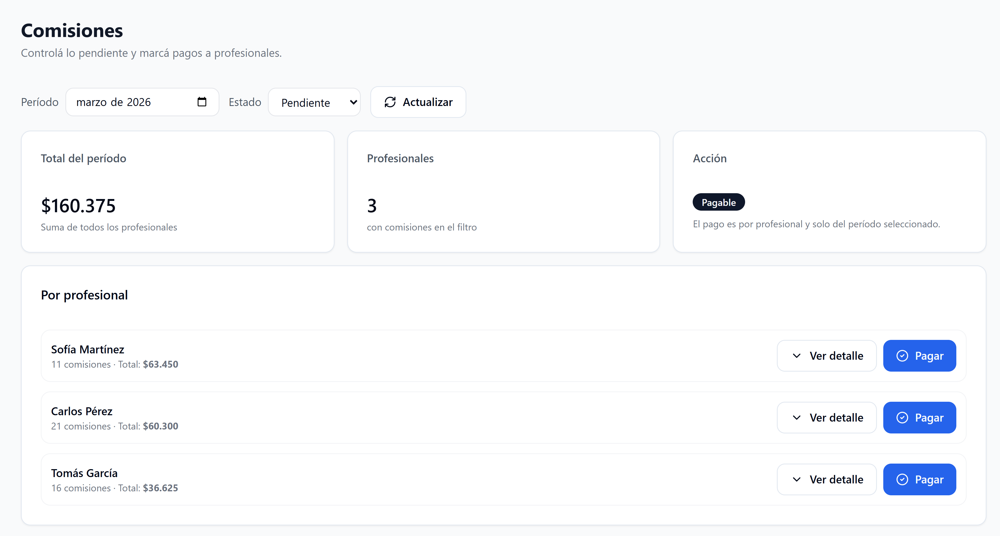
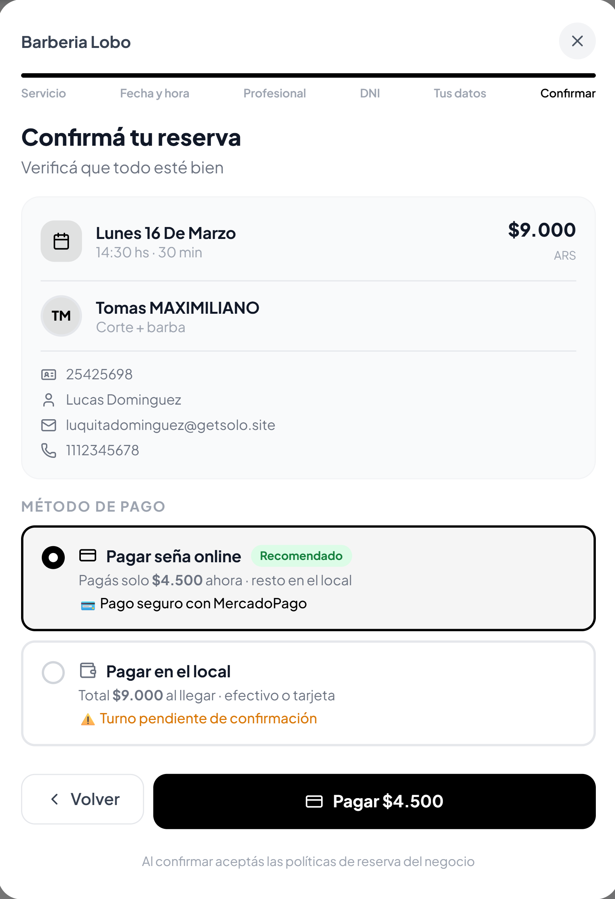

# GetSolo

SaaS para negocios de servicios en LATAM: reservas online, pagina publica, recordatorios, señas/cobros online, gestion operativa y marketplace por rubro.

**Sitio:** [getsolo.site](https://getsolo.site)

## Resumen

GetSolo es un producto pensado para negocios que trabajan por cita: barberias, peluquerias, unas, estetica, spa, nutricion, psicologia, fitness, salud y otros verticales de servicios.

La plataforma combina:

- agenda online y pagina publica de reservas
- operacion multi-profesional
- cobros online y señas
- recordatorios y notificaciones
- caja, finanzas, comisiones y reportes
- marketplace de descubrimiento por ciudad y rubro
- landings SEO programaticas por vertical y mercado

Este README esta escrito como **overview publico del producto**. El codigo completo de produccion se mantiene privado por motivos comerciales.

## Que construi en este proyecto

- Un SaaS full-stack con `Next.js 16`, `React 19`, `TypeScript` y `Supabase`.
- Un flujo de booking publico con disponibilidad real, validaciones de agenda y confirmacion de reserva.
- Un dashboard para duenos de negocio con agenda, clientes, profesionales, caja, finanzas, reportes e inventario.
- Integraciones de pagos y notificaciones para reducir ausencias y profesionalizar la operacion diaria.
- Un sistema de landings verticalizadas para SEO en distintos paises de LATAM.
- Un marketplace para descubrir negocios por rubro y ubicacion.
- Automatizaciones internas para growth, indexing y refresh de señales externas como reviews.

## Capturas

  
  

  
  

## Alcance del producto

**Verticales trabajadas**

- barberia y peluqueria
- unas, lashes, maquillaje y estetica
- spa y bienestar
- nutricion y psicologia
- fitness y entrenamiento personal
- medicina, odontologia y veterinaria

**Mercados contemplados**

- Argentina
- Mexico
- Chile
- Peru

## Modulos destacados

### 1. Booking engine

- reservas 24/7 desde pagina publica
- asignacion por profesional
- validacion de disponibilidad real
- cancelacion y confirmacion de reservas
- señas online para bajar ausencias

### 2. Operacion del negocio

- agenda diaria
- clientes y profesionales
- caja diaria
- comisiones y adelantos
- gastos, balance y reportes
- inventario, productos y ordenes

### 3. Growth y adquisicion

- paginas por vertical y mercado
- contenido y arquitectura SEO programatica
- marketplace de descubrimiento
- automatizaciones internas para indexing y growth

## Stack principal

- `Next.js`
- `React`
- `TypeScript`
- `Supabase`
- `Tailwind CSS`
- `Radix UI`
- `MercadoPago`
- `Dodo Payments`
- `Resend`
- `WhatsApp / Kapso`
- `Recharts`
- `FullCalendar`

## Nota sobre el repositorio

GetSolo es un producto comercial en desarrollo activo. Por eso, el repositorio de produccion completo no se publica de forma abierta.

Lo que si puedo mostrar publicamente es:

- el alcance real del producto
- capturas del sistema
- stack y arquitectura general
- decisiones de producto e ingenieria
- componentes o subsistemas aislados cuando tenga sentido separarlos

Si llegaste aca desde mi CV o perfil, este README funciona como snapshot del tipo de producto que construyo: software real, orientado a negocio, con foco en UX, operacion y crecimiento.
